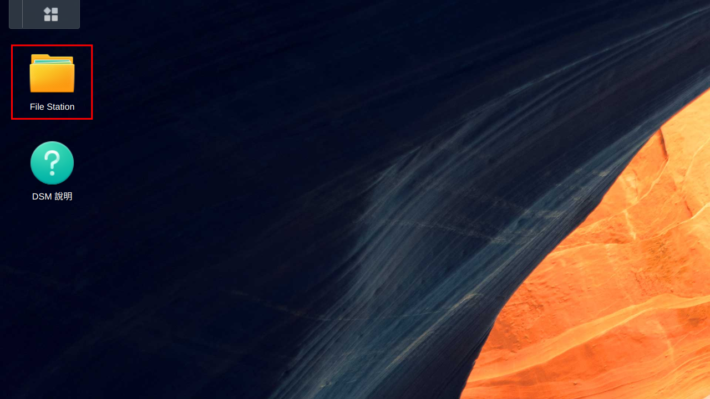

# NAS User Guide

## 說明

本文件旨在提供資工系系學會管理的 NAS [使用方式](#使用方法)與[規範](#使用規範)。若您發現文件中有缺漏或錯誤，麻煩您透過 [Pull Request](https://github.com/ncu-csie-student-association/nas-user-guide/pulls) 協助我們更正。

## 來由

中央資工從過去累積了大量的照片、活動紀錄，以及學長姐的學習筆記，起初這些資料都放在 Google 的共用雲端硬碟中，當時仍享有 Google 給予學校無限大的資料存儲容量。然而在 2024 年，Google 取消了這項福利，若要採用過去的方案，每個月需支付 20 美金 [^google-workspace-price]，累積起來是一筆龐大的金額。有鑑於此，系學會決定管理自己的 NAS 存放這些資料，並以更方便的方式共用給系上的同學。

我們的 NAS 使用 Synology 的產品，之所以不使用 TrueNAS 這樣成本更低的解決方案是基於傳承、穩定性、資料安全性為考量。我們希望這樣的解決方案是可以持續，且讓大家可放心的。在成本與其他風險間的取捨下，最後是採用了市面上相當成熟的產品作為資料存儲與共享設備。

[^google-workspace-price]: 為撰寫當下 2024 年 10 月 16 日之資料。

## 使用規範

1. 資工系系學會 NAS 存有「先人的照片」與「先人的智慧」，前者為系上各種活動的照片、紀錄；後者為學長姐們的*學習筆記*，請同學們切記**不要高調宣傳**。

2. NAS 採實名認證，若要存取 NAS 的資料，請先透過 [GitHub Issue](https://github.com/ncu-csie-student-association/nas-user-guide/issues/new/choose) 進行申請，申請內容模版與範例如下：

   ```yaml
   系級: 資工四B
   學號: 110502000
   姓名: 游帥哥
   Email: squid@squidspirit.com
   ```

   申請成功後，帳號與預設密碼將以 Email 寄出。因涉及個人隱私，若不願提供私人信箱，請使用中央大學分配以 cc.ncu.edu.tw 為域名的信箱。

3. 預設權限僅能讀取、新增，但不能刪除，如有編輯或刪除的需求，請同樣透過 [GitHub Issue](https://github.com/ncu-csie-student-association/nas-user-guide/issues/new/choose) 提出申請，其內容模版與範例如下：

   ```yaml
   學號: 110502000
   檔案位置: photo/113-期初系大/醜照.jpg
   操作: 改名成"帥照.jpg"
   原因: 不小心命名錯誤
   ```

   此請求提供非持續性的檔案編輯或刪除，若您具備權責需要長期管理相關資源（如新聞部），請另外聯繫系代或副系代。

## 使用方法

有兩種方法可以存取 NAS 的檔案，一種是透過網頁直接存取，一種是使用 SMB 協議存取，以下將會分別介紹這兩種方法各自的優點與進行方式

### 網頁存取

使用網頁存取具有以下優點：

- 在任意設備進行登入（若為陌生設備請記得使用無痕模式）
- 能取得檔案分享連結
- 能設定使用者資訊

以下為使用網頁存取的詳細步驟：

1. 進入 [NAS 網頁](https://140.115.53.250/file) 並依自己的帳號密碼進行登入。若未擁有帳號，請詳閱[使用規範](#使用規範)。

   > 我們已禁用 http 不安全的連線方式。

   成功登入後應看到以下畫面：

   

2. 點擊左上角 **File Station** 可開啟檔案管理視窗。

   

   其中 `photo` 為先人的照片，而 `wisdom` 為先人的智慧。接下來的檔案操作方式邏輯皆與電腦相差不大，交由各位自行探索。

   

3. 若要修改密碼或信箱等個人檔案，請登入 [NAS 管理頁面](https://140.115.53.250:5001)，並點擊右上角頭像調整。

### SMB 存取

SMB 全名 Server Message Block，為網路檔案分享系統，由微軟提出並一開始使用於 Windows 上，不過現今所有主流作業系統包括 macOS、Linux、iOS、Android 都對其有原生或套件的支援了。

使用 SMB 存取有以下優點：

- 如同使用本機掛載之磁碟
- 更方便的操作檔案

以下分別為在 Linux、macOS、Windows、iOS、Android 上使用 SMB 存取的步驟：

#### Linux

##### Gnome

> Linux 有眾多桌面環境，此處舉 Gnome 為例，其餘操作方法類似

1. 在檔案管理軟體中按下快捷鍵 `Ctrl-L` 或點擊 UI 編輯路徑，輸入以下路徑。

   ```text
   smb://140.115.53.250
   ```

   

2. 輸入帳號密碼，工作群組維持為 `WORKGROUP` 不需更改。

3. `photo` 為先人的照片；`wisdom` 為先人的智慧。接下來操作與一般已掛載磁碟機相同。

##### CLI

1. 安裝 `cifs-utils` 套件

2. 掛載到目標目錄，其中：

   - `/mnt` 可為任意空目錄
   - `username` 後應更改為自己的帳號

   ```bash
   # 先人的照片
   sudo mount.cifs //140.115.53.250/photo /mnt -o username=110502000
   ```

   ```bash
   # 先人的智慧
   sudo mount.cifs //140.115.53.250/wisdom /mnt -o username=110502000
   ```

3. 取消掛載

   ```bash
   sudo umount /mnt # The path just mounted
   ```

#### macOS

> 筆者無 macOS 設備

#### Windows

> 筆者無 Windows 設備

#### iOS

> 筆者無 iOS 設備

#### Android

Android 不同的手機廠商有不同的文件管理軟體，不一定能支援 SMB 連線，可尋找軟體內是否有「遠端連線」或「區域網路」類似的設定選項。若未支援，可至 Play 商店搜尋 SMB 下載支援的軟體。
